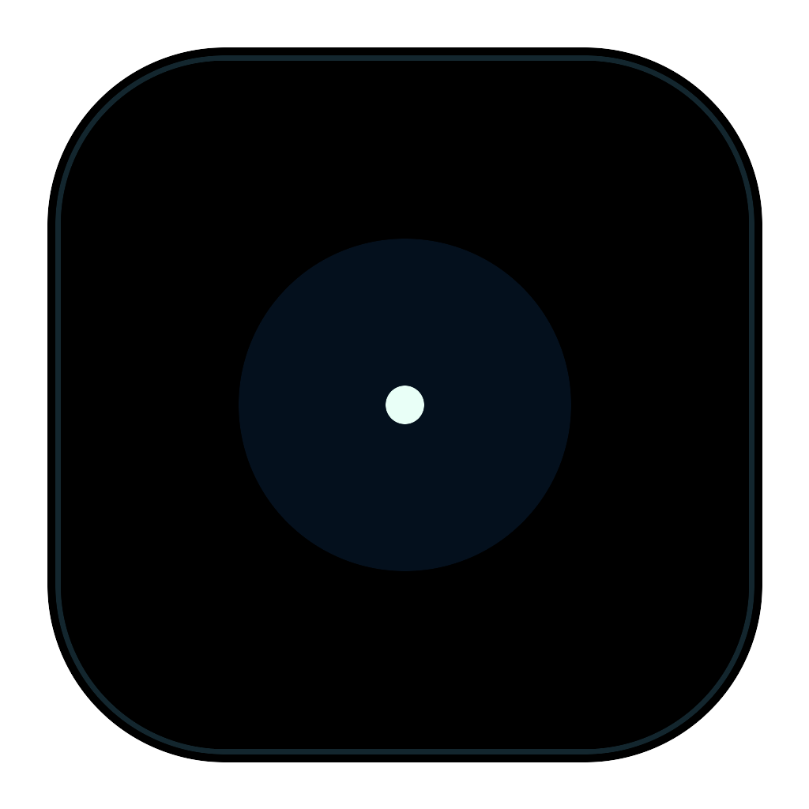
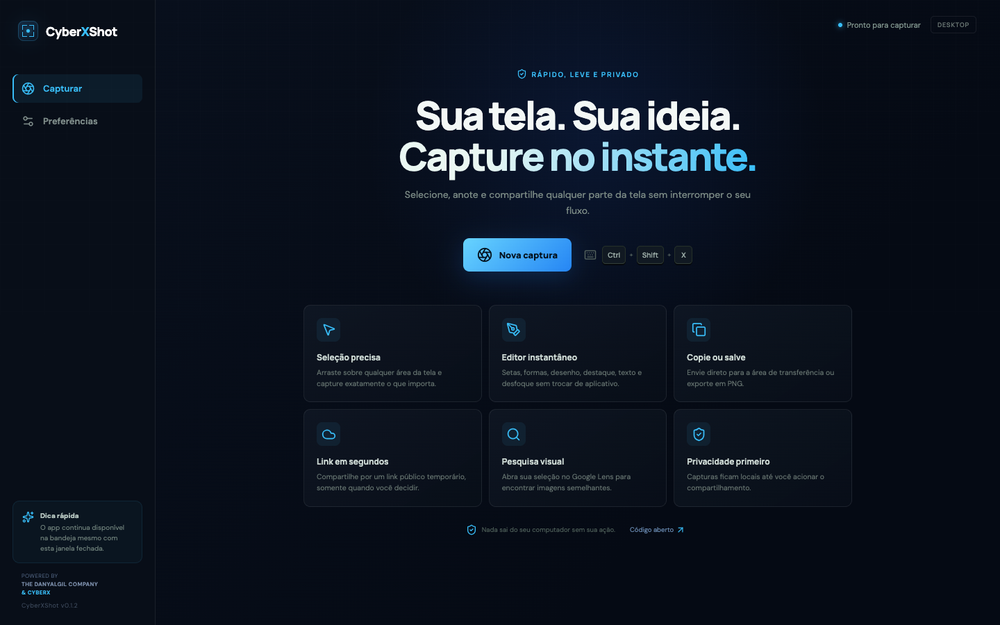

<div align="center">
  

  # CyberXShot

  **Capture anything. Explain everything. Share in seconds.**

  A fast, privacy-first screenshot tool with an instant editor for macOS and Windows.

  [](https://github.com/ricdanyalgil/CyberXShot/releases/latest)
  [](https://github.com/ricdanyalgil/CyberXShot/actions/workflows/ci.yml)
  [](LICENSE)
  [](#download)

  [Download](#download) · [Features](#features) · [Build from source](#build-from-source) · [Contribute](CONTRIBUTING.md)
</div>

<br />



## Why CyberXShot?

CyberXShot turns screen capture into a single uninterrupted flow:

> **Shortcut → Select → Annotate → Copy, save, or share**

There are no accounts, no capture history stored in the cloud, and no background uploads. Your screenshot stays on your computer unless you explicitly choose to share or search it.

## Features

| | Capability | What it gives you |
|---|---|---|
| ⚡ | **Instant capture** | Start from anywhere with `⌘/Ctrl + Shift + X` or the system tray. |
| 🎯 | **Pixel-precise selection** | Drag across the exact region you need on the display under your cursor. |
| ✏️ | **Powerful editor** | Draw with pen, line, arrow, rectangle, highlighter, text, and blur tools. |
| 🎨 | **Visual controls** | Choose annotation color and thickness without leaving the capture. |
| ↩️ | **Undo and redo** | Experiment freely while keeping every edit reversible. |
| 📋 | **Clipboard first** | Copy the finished image and paste it directly into chat, email, docs, or design tools. |
| ⚙️ | **Remembered destination** | Finish to the clipboard or save every capture directly into your chosen folder. |
| 🔄 | **Automatic updates** | Check GitHub releases, download, and install updates in-app on macOS and Windows. |
| 💾 | **Lossless export** | Save crisp PNG files at the captured screen's native resolution. |
| 🔗 | **Temporary links** | Create an explicit public link that automatically expires after one hour. |
| 🔎 | **Visual search** | Send only the selected region to Google Lens to find similar images. |
| 🛡️ | **Private by default** | Nothing leaves the device until you press Share or Visual Search. |
| 🖥️ | **Native desktop workflow** | A native capture icon and menu, global shortcuts, launch at login, and multi-display awareness. |
| 🌗 | **Focused dark interface** | A polished UI designed to stay out of the way of your content. |

## Download

### macOS

[](https://github.com/ricdanyalgil/CyberXShot/releases/download/v0.1.11/CyberXShot-0.1.11-arm64.dmg)
[](https://github.com/ricdanyalgil/CyberXShot/releases/download/v0.1.11/CyberXShot-0.1.11-x64.dmg)

Choose Apple Silicon for M-series Macs or Intel for older Macs. Open the DMG, drag CyberXShot into **Applications**, then grant **Screen Recording** permission when macOS requests it.

### Windows

[](https://github.com/ricdanyalgil/CyberXShot/releases/download/v0.1.11/CyberXShot-Setup-0.1.11-x64.exe)
[](https://github.com/ricdanyalgil/CyberXShot/releases/download/v0.1.11/CyberXShot-Portable-0.1.11-x64.exe)

Choose the installer for normal use or the portable executable when you do not want to install anything.

> [!IMPORTANT]
> macOS release builds require a Developer ID Application certificate and Apple notarization. The release workflow refuses to publish the macOS artifact when its signature, stapled ticket, or Gatekeeper assessment is invalid. Version 0.1.8 and older were distributed with an ad hoc signature and can still show a first-run warning.

## Editor tools

| Tool | Best used for |
|---|---|
| **Select** | Redrawing the capture region |
| **Pen** | Freehand notes and quick marks |
| **Line** | Separators and precise connections |
| **Arrow** | Directing attention to a specific detail |
| **Rectangle** | Framing buttons, text, or UI regions |
| **Highlight** | Emphasizing content without hiding it |
| **Text** | Adding short explanations directly to the image |
| **Blur** | Hiding passwords, addresses, tokens, or personal information |

## Keyboard shortcuts

| Action | macOS | Windows |
|---|---|---|
| New capture | `⌘ Shift X` | `Ctrl Shift X` or `Print Screen` |
| Copy capture | `⌘ C` | `Ctrl C` |
| Save capture | `⌘ S` | `Ctrl S` |
| Finish to default destination | `Enter` | `Enter` |
| Undo | `⌘ Z` | `Ctrl Z` |
| Redo | `⌘ Shift Z` | `Ctrl Shift Z` |
| Cancel | `Esc` | `Esc` |

## Privacy and security

- Screenshots are processed locally in the Electron renderer.
- The renderer has no Node.js access and runs with `contextIsolation` and sandboxing enabled.
- IPC exposes only a small, typed set of capture and export operations.
- Uploads happen only after an explicit click on **Share** or **Visual Search**.
- Temporary sharing uses [Litterbox](https://litterbox.catbox.moe/) and expires after one hour.
- Visual Search opens the resulting temporary URL in Google Lens.
- Image payloads are validated as PNG and limited to 35 MB before native operations.

Never upload screenshots containing secrets or sensitive personal information.

## Technology

| Layer | Technology |
|---|---|
| Desktop runtime | Electron 43 |
| Interface | React 19 + TypeScript |
| Build tooling | Vite |
| Icons | Lucide React + original CyberXShot artwork |
| Packaging | Electron Builder |
| Quality | Vitest + Testing Library |
| Automation | GitHub Actions for macOS and Windows |

```text
CyberXShot
├── electron/
│   ├── main.cts          # Native capture, tray, shortcuts, files and sharing
│   └── preload.cts       # Minimal typed IPC bridge
├── src/
│   ├── components/       # Dashboard and capture editor
│   ├── utils/            # Canvas composition and PNG export
│   └── types.ts          # Shared application contracts
├── build/                # Cross-platform application artwork
└── .github/workflows/    # CI and release pipelines
```

## Build from source

### Requirements

- Node.js 22.12 or newer
- npm 10 or newer
- macOS or Windows for native packaging

```bash
git clone https://github.com/ricdanyalgil/CyberXShot.git
cd CyberXShot
npm install
npm run dev
```

### Validation and packaging

```bash
npm test          # Run automated tests
npm run build     # Type-check and build the application
npm run dist:mac  # Build DMG and ZIP on macOS
npm run dist:win  # Build NSIS installer and portable EXE on Windows
```

Every push to `main` is tested on both macOS and Windows. Version tags automatically create a GitHub release with platform-specific downloads.

### macOS release credentials

Signed macOS releases require these GitHub Actions secrets:

| Secret | Value |
|---|---|
| `MAC_CSC_LINK` | Base64-encoded `.p12` containing the Developer ID Application certificate and private key |
| `MAC_CSC_KEY_PASSWORD` | Password used when exporting the `.p12` |
| `APPLE_ID` | Apple Developer account email |
| `APPLE_APP_SPECIFIC_PASSWORD` | App-specific password created at appleid.apple.com |
| `APPLE_TEAM_ID` | 10-character Apple Developer Team ID |

Never use the normal Apple ID password or commit certificate material to the repository.

## Roadmap

- [ ] Optional encrypted local capture history
- [ ] User-configurable and self-hosted upload providers
- [ ] Window-level capture and keyboard-driven selection
- [x] Signed and notarized production binaries
- [x] Automatic update checks and in-app installation on macOS and Windows
- [ ] Additional interface languages

## Contributing

Bug reports, feature proposals, design improvements, and pull requests are welcome. Read [CONTRIBUTING.md](CONTRIBUTING.md) before opening a contribution. Security-sensitive reports should follow [SECURITY.md](SECURITY.md).

## Independence notice

CyberXShot is an original open-source implementation inspired by the fast capture workflow popularized by tools such as Lightshot. It is not affiliated with, endorsed by, or derived from Lightshot, Skillbrains, or prntscr.com.

## License

Released under the [MIT License](LICENSE).

<div align="center">
  <strong>Powered by The Danyalgil Company &amp; CyberX</strong><br />
  <sub>Built for people who communicate visually.</sub>
</div>
